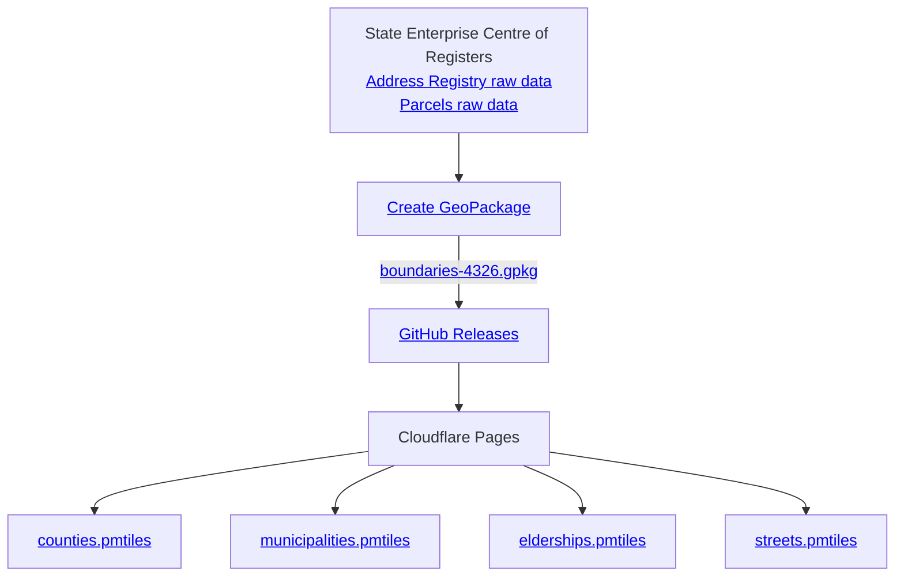

# National Boundaries Vector Tiles of Lithuania

Access simplified and regularly updated vector tiles of national boundaries in Lithuania from the Address Registry.

## Key Features

1. **Ready to Use**: Pre-simplified and ready-to-serve vector tiles.
2. **Easy Hosting**: Available as a single-file PMTiles archive, easily hosted on platforms like S3.
3. **Regular Updates**: Daily updates reflecting boundary changes.
4. **Available Hosted Versions**: Hosted versions of boundaries are readily available for direct use.
5. **Open Source**: Free and open-source. Join our community of contributors.

## Usage

For details on using PMTiles, check the [PMTiles in the browser](https://docs.protomaps.com/pmtiles/maplibre)
documentation.

### Hosted Versions

Use hosted versions of boundaries on your website, with global low latency and high SLA via Cloudflare Pages.

| Type                  | Lithuanian Translation    | Demo                                                                                                                            | PMTiles Archive URL                                                                       |
| --------------------- | ------------------------- | ------------------------------------------------------------------------------------------------------------------------------- | ----------------------------------------------------------------------------------------- |
| **Counties**          | Apskričių ribos           | [Demo](https://pmtiles.io/?url=https%3A%2F%2Fboundaries.startupgov.lt%2Fpmtiles%2Fcounties.pmtiles#map=6.95/55.191/22.92)       | [counties.pmtiles](https://boundaries.startupgov.lt/pmtiles/counties.pmtiles)             |
| **Municipalities**    | Savivaldybių ribos        | [Demo](https://pmtiles.io/?url=https%3A%2F%2Fboundaries.startupgov.lt%2Fpmtiles%2Fmunicipalities.pmtiles#map=6.95/55.191/22.92) | [municipalities.pmtiles](https://boundaries.startupgov.lt/pmtiles/municipalities.pmtiles) |
| **Elderships**        | Seniūnijų ribos           | [Demo](https://pmtiles.io/?url=https%3A%2F%2Fboundaries.startupgov.lt%2Fpmtiles%2Felderships.pmtiles#map=6.95/55.191/22.92)     | [elderships.pmtiles](https://boundaries.startupgov.lt/pmtiles/elderships.pmtiles)         |
| **Residential Areas** | Gyvenamųjų vietovių ribos | -                                                                                                                               | Not Available                                                                             |
| **Streets**           | Gatvių ribos              | [Demo](https://pmtiles.io/?url=https%3A%2F%2Fboundaries.startupgov.lt%2Fpmtiles%2Fstreets.pmtiles#map=11/54.6828/25.2686)       | [streets.pmtiles](https://boundaries.startupgov.lt/pmtiles/streets.pmtiles)               |
| **Parcels**           | Žemės sklypų ribos        | -                                                                                                                               | Not Available                                                                             |

### Self-Hosting

Download the latest PMTiles archives and host them on your own server.

| Type                  | Lithuanian Translation    | PMTiles Archive URL                                                                                                          |
| --------------------- | ------------------------- | ---------------------------------------------------------------------------------------------------------------------------- |
| **Counties**          | Apskričių ribos           | [counties.pmtiles](https://github.com/govlt/national-boundaries/releases/latest/download/counties.pmtiles)                   |
| **Municipalities**    | Savivaldybių ribos        | [municipalities.pmtiles](https://github.com/govlt/national-boundaries/releases/latest/download/municipalities.pmtiles)       |
| **Elderships**        | Seniūnijų ribos           | [elderships.pmtiles](https://github.com/govlt/national-boundaries/releases/latest/download/elderships.pmtiles)               |
| **Residential Areas** | Gyvenamųjų vietovių ribos | [residential-areas.pmtiles](https://github.com/govlt/national-boundaries/releases/latest/download/residential-areas.pmtiles) |
| **Streets**           | Gatvių ribos              | [streets.pmtiles](https://github.com/govlt/national-boundaries/releases/latest/download/streets.pmtiles)                     |
| **Parcels**           | Žemės sklypų ribos        | [parcels.pmtiles](https://github.com/govlt/national-boundaries/releases/latest/download/parcels.pmtiles)                     |

## Architecture



## Development Setup

- **Install Java 21+**: Ensure Java is installed for running the mapping engine.

### Generating Tiles

To generate the tiles in PMTiles format:

```shell
make generate
```

Find the output in `data/output`.

### Previewing

Ensure [Docker](https://www.docker.com/get-started/) (version 2.22+ preferred) is installed. Then, run:

```shell
make preview
```

This will start [Tileserver-GL](https://github.com/maptiler/tileserver-gl) at http://localhost:8080 for previewing.

## License

This project is licensed under the [MIT License](./LICENSE). Data is licensed
under [CC BY 4.0](https://creativecommons.org/licenses/by/4.0/deed.lt). For more information,
visit [Registrų centras](https://www.registrucentras.lt/p/1187).

While preparing the National Boundaries Vector Tiles, some changes were made, such as changing attribute names to
English. For full details, check out the [create-geopackage.sh](./create-geopackage.sh) file.

## Contributing

We welcome contributions! For details, see
our [contribution guidelines](https://github.com/govlt/.github/blob/main/CONTRIBUTING.md).
